# Procesverslag
Markdown is een simpele manier om HTML te schrijven.  
Markdown cheat cheet: [Hulp bij het schrijven van Markdown](https://github.com/adam-p/markdown-here/wiki/Markdown-Cheatsheet).

Nb. De standaardstructuur en de spartaanse opmaak van de README.md zijn helemaal prima. Het gaat om de inhoud van je procesverslag. Besteedt de tijd voor pracht en praal aan je website.

Nb. Door *open* toe te voegen aan een *details* element kun je deze standaard open zetten. Fijn om dat steeds voor de relevante stuk(ken) te doen.

## Jij

  
uitwerken voor kick-off werkgroep

  ### Auteur:
  Ralph van ravenstein

  #### Je startniveau:
  blauw

  #### Je focus:
  (surface plane) 
  Ik wil een basic website kunnen maken en focus me op de css.
 

## Je website

  
uitwerken voor kick-off werkgroep

  ### Je opdracht:
  https://bitvavo.com/nl : Nederlandse crypto broker 

  #### Screenshot(s) van de eerste pagina (small screen): 
  Bitvavo homepagina
  

  #### Screenshot(s) van de tweede pagina (small screen):
   Support home pagina
  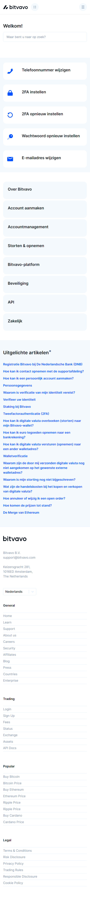
 

## Toegankelijkheidstest 1/2 (week 1)

  
uitwerken na test in 1e werkgroep

  ### Bevindingen
  Lijst met je bevindingen die in de test naar voren kwamen:
  * Screen-reader slaat de opties "Koersen" & "Informatie" in de nav-bar over.
  * Soms staat de  boven de <h2> en dat helpt niet als je een screen-reader gebruikt.
  
  #### Screenreader
  De screen-reader werkt niet al te goed met de website.
  In de nav worden er 2 dropdown menus overgeslagen en leest eerst de img en dan de text bij artikels en carousellen
  
  xxxxxxxxxxxxxxxxxxxxx (wordt vervolgd: oplossing en foto's komen nog) xxxxxxxxxxxx

  #### Muis en Toetsenbord 
 Website is goed te gebruiken.
  

  #### Motoriek (shocks, elastiekjes)
 Website is goed te gebruiken. Knoppen zijn groot en makklijk te klikken.

  #### Visueel (brillen, contrast, kleurenblind, dark/light). 
 Website is slecht te gebruiken. 
    Site heeft een laag contrast en gebruikt soms een klein lettertype. 
    De site heeft een witte achtergrond en gebruikt veel velle kleuren. dit kan voor sommige pijnlijk zijn om lang naar te kijken.
  
  - oplossing: Kleuren gebruiken met een hoog contrast gebruikten, kleine letter vermijden. Mischien de optie geven tussen een Dark-mode, Colorblind-mode en een Low-visability-mode
  

## Breakdownschets (week 1)

  
uitwerken na afloop 2e werkgroep

  ### de hele pagina: 
  

  ### dynamisch deel (bijv menu): 
  

  ### wellicht nog een dynamisch deel (bijv filter): 
  

## Voortgang 1 (week 2)

  
uitwerken voor 1e voortgang

  ### Stand van zaken
  hier dit ging goed & dit was lastig (neem ook screenshots op van delen van je website en code)

  ### Agenda voor meeting
  samen met je groepje opstellen

  | student 1      | student 2          | student 3    | student 4        |
  | ---            | Ralph              | ---          | ---              |
  | dit bespreken  | en dit             | en ik dit    | en dan ik dat    |
  | en dat ook nog | dit als er tijd is | nog een punt | dit wil ik zeker |
  | ...            | * navbar/dropdown  | ...          | ...              |
                     * H1234 sam.
                     * sections btn
                     * 

  ### Verslag van meeting
  hier na afloop snel de uitkomsten van de meeting vastleggen

  - read me uit werken
  - HTML nav
  - HTML 
  - CSS

## Voortgang 2 (week 3)

  
uitwerken voor 2e voortgang

  ### Stand van zaken
  hier dit ging goed & dit was lastig (neem ook screenshots op van delen van je website en code)
    * HTML
    * Breakdown verbeteren
    * beginnen met CSS

  ### Agenda voor meeting
  samen met je groepje opstellen

  | student 1      | Ralph              | student 3    | student 4        |
  | ---            | positioneren       | ---          | ---              |
  | dit bespreken  | Nav verbeteren     | en ik dit    | en dan ik dat    |
  | en dat ook nog | werken met sections| dit wil      |
  | ...            | carousel werkt niet| ...          | ...              |

  ### Verslag van meeting
  hier na afloop snel de uitkomsten van de meeting vastleggen

  - Body margin stonden aan. positioneren opnieuw verbeteren.
  - Nav menu nogsteeds niet goed werkent.
  - read me uitwerken.
- ...

## Toegankelijkheidstest 2/2 (week 4)

  
uitwerken na test in 8e werkgroep

  ### Bevindingen
  Lijst met je bevindingen die in de test naar voren kwamen (geef ook aan wat er verbeterd is):
  
  De leesbaarheid van de text is allemaal voldoende. 
  
  De screenreader sloeg de dropdowns over in het nav menu.
  (Nu is dat wel verbeterd, maar leest ook het hele menu af als het niet zichtbaar is.)

  
  
  #### Screenreader  
  De screenreader sloeg de dropdowns over in het nav menu en soms ook de gehele nav.

  
   
  
  - (Nu is dat wel verbeterd, maar leest ook het hele menu af als het niet zichtbaar is.)

  

  #### Muis en Toetsenbord 
  n/a

  #### Motoriek (shocks, elastiekjes)
  De site was redelijk goed te navigeren met een minder verfijnde motorie.

  #### Visueel (brillen, contrast, kleurenblind, dark/light). 
 over het algemeen was de site goed te navigeren met kleurenblindheid en of met een bril.
  
  Aleen de site gebruikt veel grijze text op een witte achtergrond en dit zocht voor een laag contrast, een 4.3.
  
  Ik zou graag een darkmode willen maken maar ben daar niet aan toegekomen.

## Voortgang 3 (week 4)

  
uitwerken voor 3e voortgang

  ### Stand van zaken
  hier dit ging goed 
  
  Het eerste gedeelte van de site. de nav voor telefoon, section1 en de tabel, de uitklap gedeeltes, de eerste carousel.
  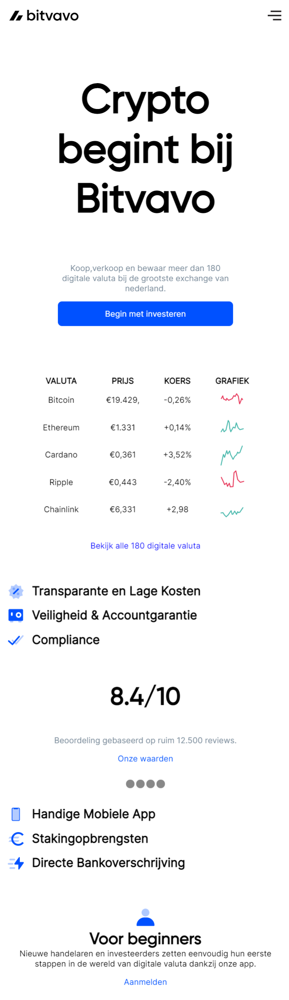
  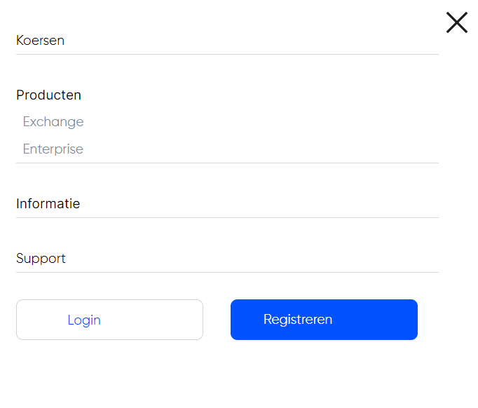
  
  & dit was lastig 
  
  Ik had problemen met de 2de carousel. de puntjes werden maar niet zichtbaar.
   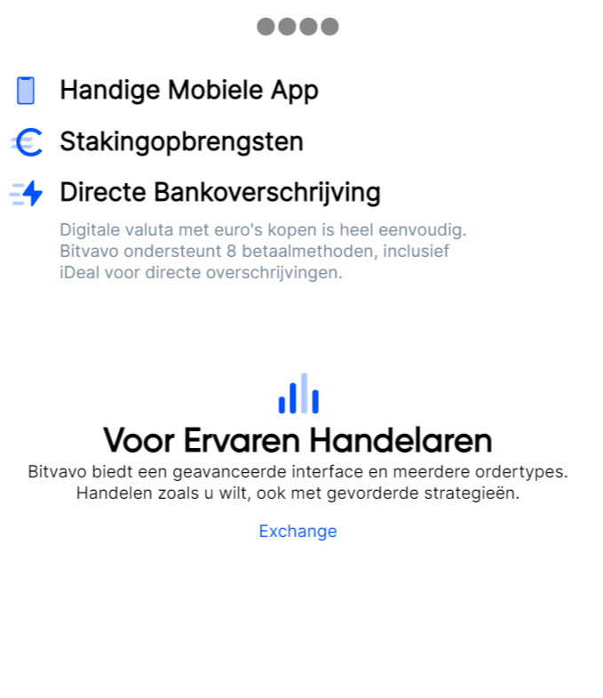
  
  
  De nav voor desktop formaat kreeg ik niet werkend.
   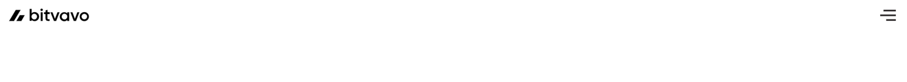
  
  Op de 2de pagina kreeg ik een gedeelte niet werkend. (Dit komt grotendeels omdat ik te druk bezig was met de homepagina afmaken.)
   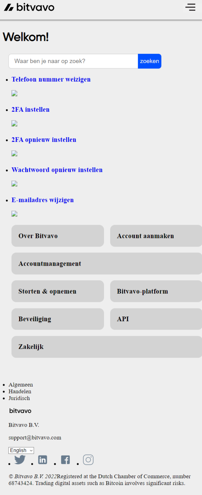
  ### Agenda voor meeting
  samen met je groepje opstellen

  | student 1      | student 2                            | student 3    | student 4        |
  | ---            | Hoe krijg ik de Nav (desktop), 2de   | ---          | ---              |
  | dit bespreken  | carousel werkend?                    | en ik dit    | en dan ik dat    |
  | en dat ook nog | Hoe werk ik moet media querys        | nog een punt | dit wil ik zeker |
  | ...            | ...                                  | ...          | ...              |

  ### Verslag van meeting
  hier na afloop snel de uitkomsten van de meeting vastleggen

  - kijk naar : https://dequeuniversity.com/rules/axe/4.4/label
  - voeg aria labels toe aan menu items.

## Eindgesprek (week 5)

  
uitwerken voor eindgesprek

  ### Je uitkomst - karakteristiek screenshots:
  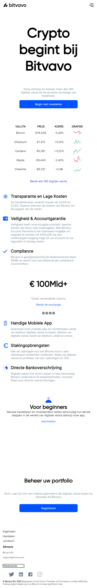

  ### Dit ging goed/Heb ik geleerd: 
  Korte omschrijving met plaatjes
  
  Het positioneren van elementen. De tabel die ik heb gemaakt, waar ik eigenlijk zwaar tegenop keek. De uitklap nav en het positioneren van de elementen daarin.
  
  Ik been obrecht al erg blij en trots dat ik zover be gekomen. ik heb erg blij dat ik nog redelijk in de buurt be gekomen met de stijl van de orginele site. Al is niet alles compleet, ik vindt zelf dat ik heel wat heb geleerd. 
  Hiervoor begreep ik niks van html aleen al en nu kan ik basic code lezen en begrijpen :)
  
  
  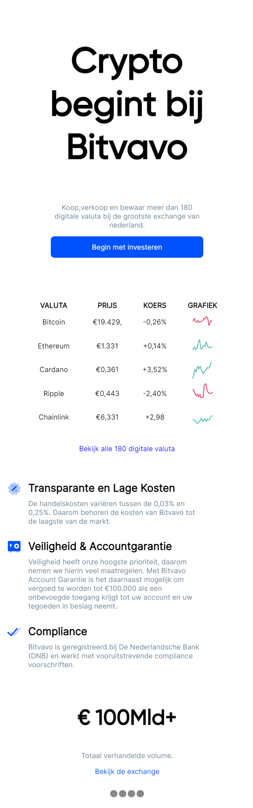

  ### Dit was lastig/Is niet gelukt:
  Korte omschrijving met plaatjes

    Voor een of andere reden kreeg ik geen puntjes onder deze carlous...
  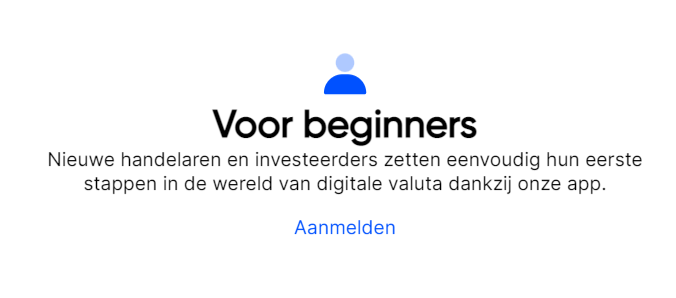
    Nav op desktop formaat.
    

  
  
  
  
  
  
  
  

## Eindgesprek - herkansing(week 6)

  
uitwerken voor eindgesprek

  ### Je uitkomst - karakteristiek screenshots:
  
  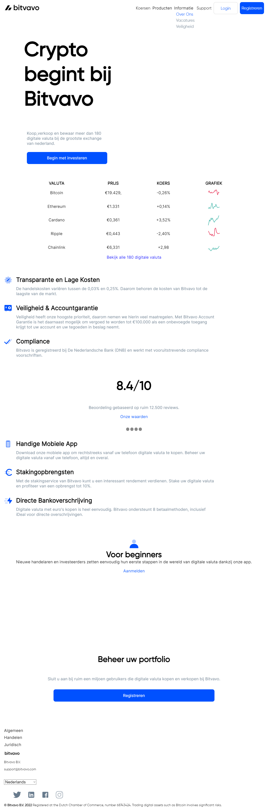

   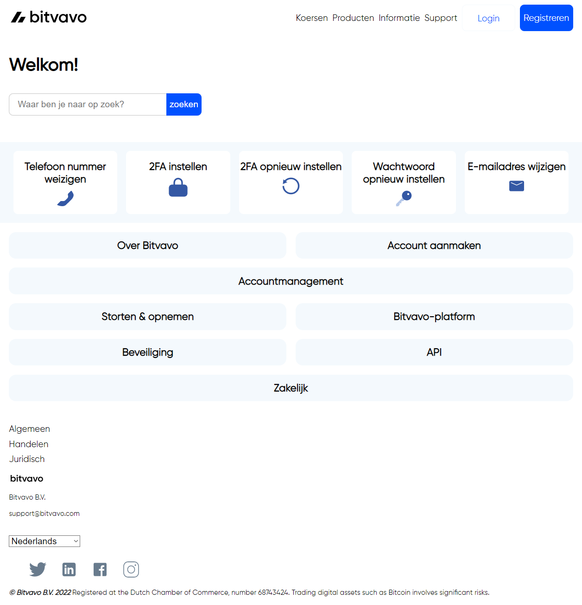

  ### Dit ging goed/Heb ik geleerd: 
  Korte omschrijving met plaatjes
  
  De support pagina ging in mijn opzichte erg goed. ik ben erg blij met het resultaat.
  
  
  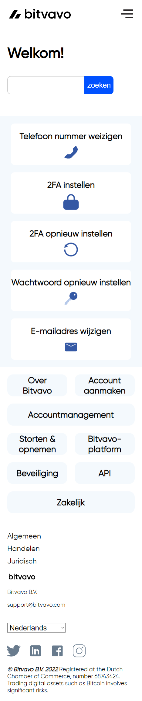

  Daarnaast ben ik ook erg trots op vele andere kleinere dingen. Problemen die ikzelf heb kunnen oplossen door middel out-of-the-box en logisch na te denken.
  Ik ben tegen ontelbare problemen opgelopen en ben versteld dat dit het resultaat is geworden.

  ### Dit was lastig/Is niet gelukt:
  Korte omschrijving met plaatjes

  
  het is mij niet gelukt om op de homepagina een foto te krijgen aan de rechterkant.
    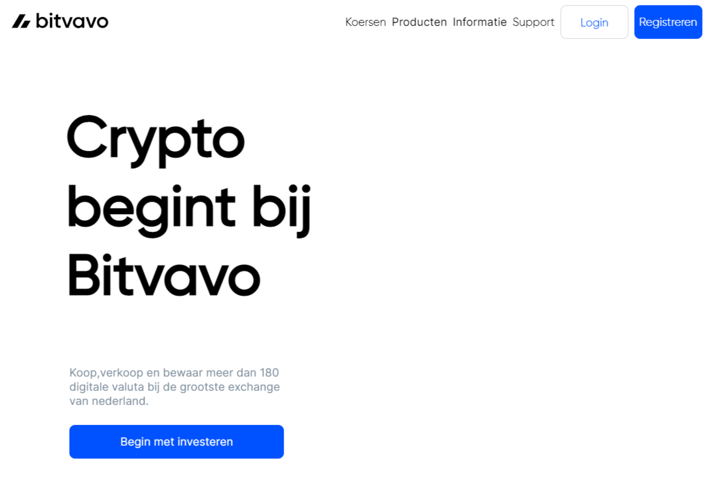
  deze foto moest erin
     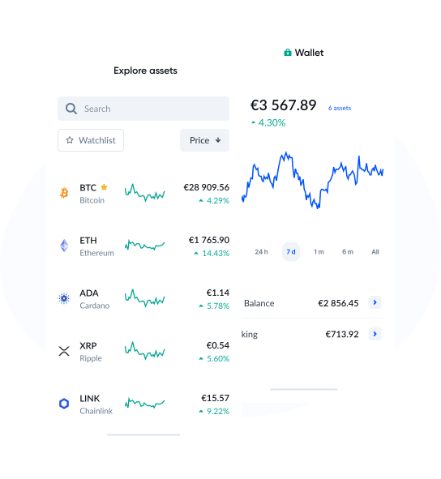
  
  
  daarnaast is het mij niet gelukt om op de support pagina de icons boven de h3 te ordenen :(
  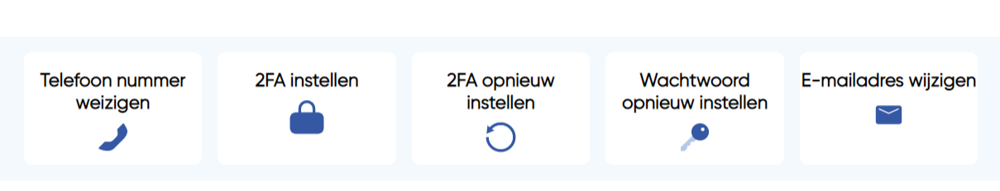
  
  
    Voor een of andere reden kreeg ik geen puntjes onder deze carlous...
  
 

  
  
  
  
  

## Bronnenlijst

  
continu bijhouden terwijl je werkt

  Nb. Wees specifiek ('css-tricks' als bron is bijv. niet specifiek genoeg).

  1. Sanne / sanne's github uitleg.
  2. book: The complete coding manual 2020 html css javascript
  3. 

